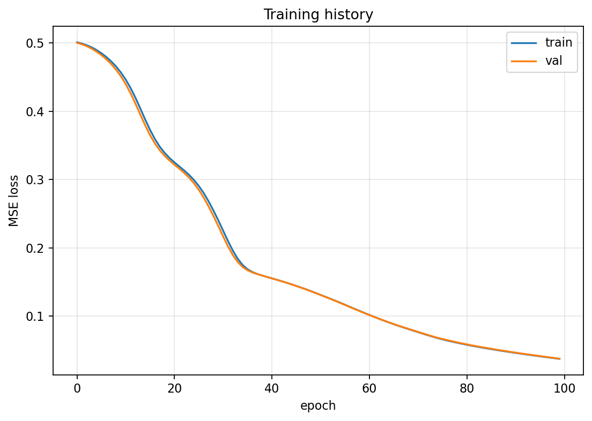
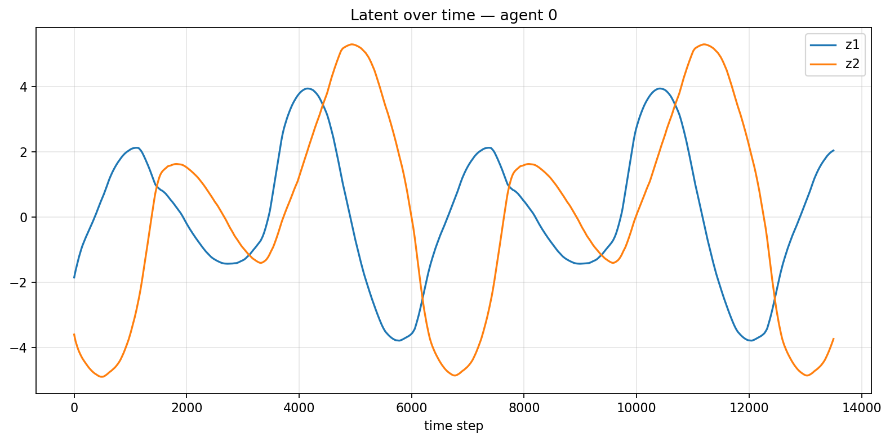
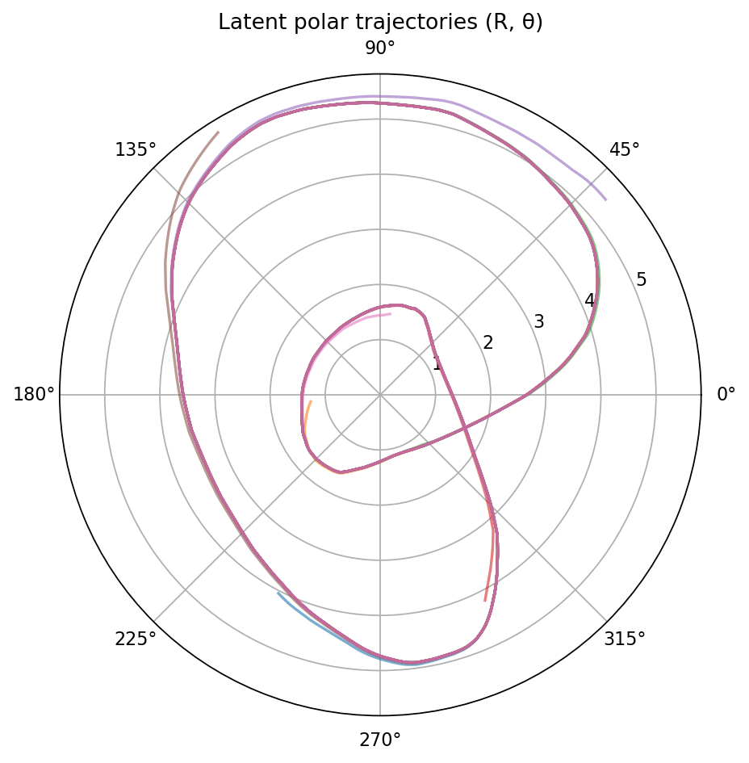

# Discovering Latent Linear Manifolds in Swarms

> *"You don't predict pixels, you predict an abstract representation of pixels."* - Yann Lecun

This project implements a deep neural network (DNN)–based autoencoder to discover the essence of multi-agent swarm dynamics in the form of linear manifolds. Figure 0 provides an example of the system investigated here, where 7 agents coordinate to trace a Lemniscatic Arc. Note the trajectory shown is emergent, with each agent relying on local information (i.e, the states of it leading and lagging neighbours) only. Preserving this feature of locality, the learning implemented here is also accomplished using only local state data from each agent.

<figure style="text-align:center;">
  
  <figcaption><b>Figure 0:</b> Lemniscatic Arc of 7 Agents</figcaption>
</figure>

## Background

This work is motivated by a desire to discover underlying linearity in such applications so that robust, efficient control strategies may be designed to produce the kind of emergent behavior shown above. 

 In ["Flocks, Mobs, and Figure Eights: Swarming as a Lemniscatic Arc"](https://ieeexplore.ieee.org/document/9931405), the authors stabilized a swarm of agents in 3D space by controlling them indirectly through a 2D embedding space. This approach permitted the use of well-established linear control policies in reduced-dimension, polar coordinates while preserving all of the functional properties of the swarm. This was later generalized for a broader set of curves in ["Emergent homeomorphic curves in swarms"](https://doi.org/10.1016/j.automatica.2025.112221), where we reconceptualized this embedding as a latent space that captures the essential structure of the swarm.

## Implementation Details

We implement a DNN-based autoencoder to discover low-dimensional manifolds that capture the essence of the swarm motion and agent interaction patterns. The network is trained to minimize reconstruction loss while regularizing the latent space to satisfy approximate linear dynamics. Each agent learns only from its own local information (positions, velocities, and neighbor relationships), reflecting decentralized swarm behavior.

### Identifying Neighbours

Identifying neighbor relationships is a critical preprocessing step. We employ the method outlined in ["Finding Neighbours in Busy Trajectories"](https://github.com/tjards/finding_neighbours) to infer neighbours based on relative trajectories projected forward and backwards. 

### Model Architecture

The model is implemented in **PyTorch** and trained on synthetic data generated using the [m-a_s simulator](https://github.com/tjards/multi-agent_sim). 

Detailed information about the model architecture is stored in the provide meta.json file, which we summarize here:

- **Encoder:** Three-layer feedforward neural network with ReLU activations, mapping input features to a 2D latent space.  
- **Decoder:** Symmetric structure reconstructing the original features from the latent code.  
- **Linearity:**  When enabled (`USE_CONTROL = True`), the model includes trainable matrices \(A\) and \(B\) enforcing approximate linear dynamics using the classic state-space equation $z_{t+1} = A z_t + B u_t$, where $z_t$ is the encoded latent state and $u_t$ represents the agent’s control input.
- **Loss Function:** The combined loss is a weighted sum of reconstruction error and latent-dynamics error: $\mathcal{L} = w_{\text{err}}\|x-\hat{x}\|^2 + w_{\text{dyn}}\|z_{t+1}-(A z_t+B u_t)\|^2.$

### Code Structure

The code is modular and structured as follows:
- `main.py` manages overall functionality. 
- `autoencoder.py` defines the PyTorch model and training routine.  
- `preprocess.py` handles feature generation and normalization. 
- `loader.py` builds PyTorch data loaders for training.  
- `neighbour_finder.py` computes neighbor relationships.

## Training Setup

We provide an example training session with the following hyperparameters:

| Parameter | Value | Description |
|------------|-------|-------------|
| `TRAIN_FRAC` | 0.5 | Fraction of samples used for training (remainder for validation) |
| `DEVICE` | `'cpu'` | Device for model training (`'cuda'` supported if available) |
| `LATENT_DIM` | 2 | Dimensionality of the latent space |
| `BATCH_SIZE` | 512 | Mini-batch size during training |
| `EPOCHS` | 100 | Number of training epochs |
| `LEARNING_RATE` | 1e-4 | Adam optimizer learning rate |
| `PATIENCE` | 10 | Early stopping tolerance (epochs without improvement) |
| `USE_CONTROL` | True | Enables latent linearization using control inputs |
| `WEIGHT_ERR` | 0.5 | Weight of reconstruction error term in total loss |
| `WEIGHT_DYN` | 0.5 | Weight of latent-dynamics regularization term |

---

## Training Results

### Training and Validation Loss

**Figure 1.** *Training and validation mean-squared error (MSE) loss over epochs. The close alignment of both curves indicates stable generalization and balanced weighting between reconstruction and latent-dynamics objectives.*

### Latent Space Evolution 

**Figure 2.** *Temporal evolution of the latent variables $z_1, z_2$ for selected Agent 0. The smooth, bounded trajectory suggests coherent encoding of the agent’s local state and control interactions. Note also the periodicity.*

### Polar Projection of Latent Embeddings

**Figure 3.** *Polar representation of the two-dimensional latent embeddings when applied to other agents in the swarm. The roughly circular topology corresponds to recurrent or orbit-like structures in the learned swarm dynamics.*

## Model Artifacts

| File | Description |
|------|--------------|
| `models/weights.pth` | Trained PyTorch model weights |
| `models/normalizer_states.npz` | Mean and standard deviation for state normalization |
| `models/normalizer_cmds.npz` | Mean and standard deviation for control normalization |
| `models/neighbours.npz` | Ahead/behind neighbor indices for each agent |
| `models/meta.json` | Metadata including configuration, training statistics, and hyperparameters |

## Citation

The code is opensource but, if you reference this work in your own research, please cite me. I have provided an example bibtex citation below:

`@techreport{Jardine-2025,
  title={Discovering Latent Linear Manifolds in Swarms},
  author={Jardine, P.T.},
  year={2025},
  institution={Queen's University, Kingston, Ontario},
  type={GitHub Repository},
}`

Alternatively, you can cite any of my related papers, which are listed in [Google Scholar](https://scholar.google.com/citations?hl=en&user=RGlv4ZUAAAAJ&view_op=list_works&sortby=pubdate).

